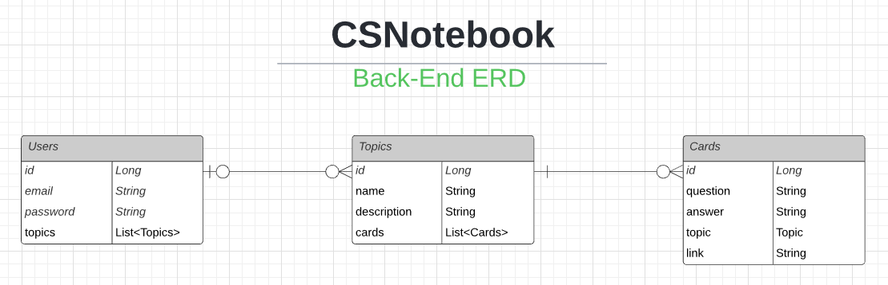
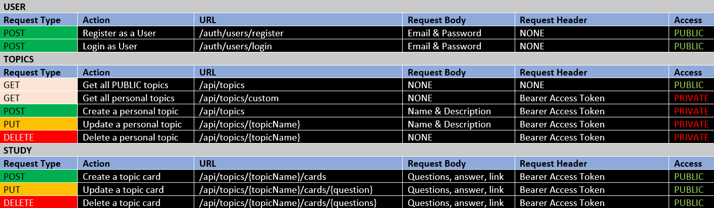
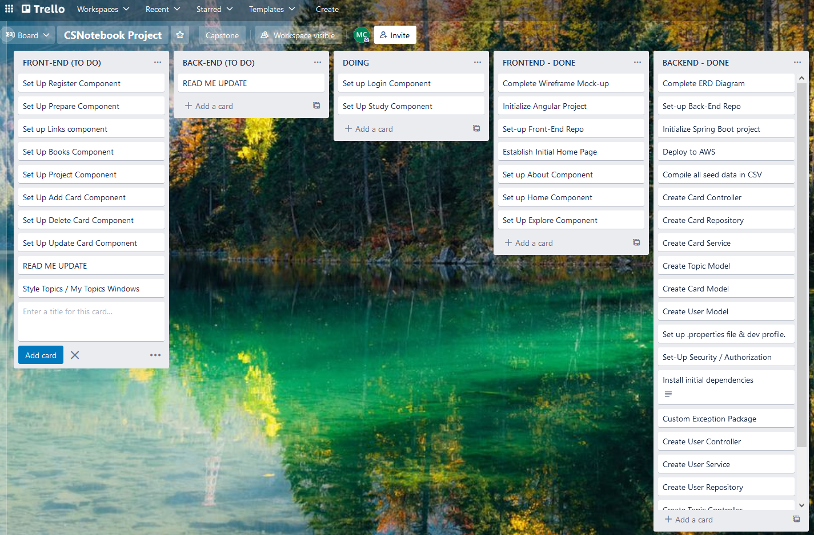

# NOTEBOOK (BACKEND) - REST API

## :book: INTRODUCTION :book:
This project serves as the backend for the "CSNotebook" web application. The aim of this project is to deliver a useful training / learning resource to help individuals within the many realms of computer science develop their knowledge and understanding of the field and to grow as professionals. 

## :computer: CORE TECHNOLOGIES :computer:

&nbsp;&nbsp;&nbsp;&nbsp;&nbsp;&nbsp;&nbsp;&nbsp;&nbsp;&nbsp;&nbsp;&nbsp;&nbsp;&nbsp;&nbsp;&nbsp;&nbsp;&nbsp;&nbsp;&nbsp;&nbsp;&nbsp;&nbsp;&nbsp;&nbsp;&nbsp;&nbsp;&nbsp;  

## :cloud: CLOUD TECHNOLOGIES / DEPLOYMENT :cloud:

&nbsp;&nbsp;&nbsp;&nbsp;&nbsp;

## ER-DIAGRAM

## USER STORIES

## PROJECT BOARD

